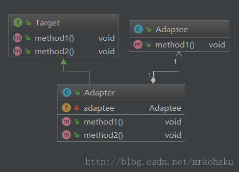

# JAVA设计模式——适配器模式
## 一.主要概念
### 1.定义
    把一个类的接口变换成客户端所期待的另一种接口，从而使原本因接口不匹配而无法在一起工作的两个类能够在一起工作。
### 2.适配器模式涉及的角色
    源（Adaptee）：需要被适配的对象或类型，相当于插头。
    适配器（Adapter）：连接目标和源的中间对象，相当于插头转换器。
    目标（Target）：期待得到的目标，相当于插座。
### 3.适配器模式实现的三种方式
    类适配器模式、对象适配器模式、接口适配器模式

## 二.具体实现

### 1. 类适配器模式
    从下面的结构图可以看出，Adaptee类并没有method2()方法，而客户端则期待这个方法。为使客户端能够使用Adaptee类，我们把Adaptee与Target衔接起来。
    Adapter与Adaptee是继承关系，这决定了这是一个类适配器模式。由于java无多继承，类适配模式应用不广泛

#### 代码实现
    
#### 源
    /**
     * 源（Adaptee）：需要被适配的对象或类型
     * 实现功能：造车（白色宝马）
     * 目标功能：改变汽车颜色
     */
    public class CarFactoryImplBm implements CarFactory {
    
        @Override
        public Car createCar() {
            Car car = new Car();
            car.setName("宝马");
            car.setColor("白色");
            return car;
        }
    }
#### 目标
    /**
     *目标（Target）：期待得到的目标
     * 期待实现的功能（改变汽车颜色）
     */
    public interface CarDemand {
        public Car changeColor(Car car);
    }
#### 适配器
    /**
     * 适配器（Adapter）：连接目标和源的中间对象，相当于插头转换器。
     * 1.通过继承方式实现造白色宝马车功能
     * 2.通过实现目标功能，实现改变颜色功能
     * 类适配器模式：
     */
    public class CarAdapter extends CarFactoryImplBm implements CarDemand {
        @Override
        public Car changeColor(Car car) {
            car.setColor("黑色");
            return car;
        }
    }
### 2.对象适配模式
    从下面的结构图可以看出，Adaptee类并没有method2()方法，而客户端则期待这个方法。与类适配器模式一样，为使客户端能够使用Adaptee类，
    我们把Adaptee与Target衔接起来。但这里我们不继承Adaptee，而是把Adaptee封装进Adapter里。这里Adaptee与Adapter是组合关系。 
  
#### 代码
    /**
     * 对象适配器
     * 通过组合方式来实现适配器功能。
     */
    public class CarObjectAdpter implements CarDemand {
    
        CarFactoryImplBm carFactoryImplBm;
    
        CarFactoryImplAd carFactoryImplAd;
    
        public CarObjectAdpter(CarFactoryImplAd carFactoryImplAd,CarFactoryImplBm carFactoryImplBm){
            carFactoryImplAd = carFactoryImplAd;
            carFactoryImplBm = carFactoryImplBm;
        }
    
        public Car createCar(String carType){
            Car car = null;
            if ("bm".equals(carType)){
                car = carFactoryImplBm.createCar();
            }
            if ("ad".equals(carType)){
                car = carFactoryImplAd.createCar();
            }
            return car;
        }
    
        @Override
        public Car changeColor(Car car) {
            car.setColor("红色");
            return car;
        }
    }
## 三.总结
### 1.类适配器与对象适配器的区别
    1.类适配器使用的是继承的方式， 对象适配器使用的是组合的方式
    2.基于组合/聚合优于继承的原则，使用对象适配器是更好的选择。（java无多继承，不方便扩展）
### 2.jdk应用场景
    java.util.Arrays#asList()
    java.io.InputStreamReader(InputStream)
    java.io.OutputStreamWriter(OutputStream)
    
    