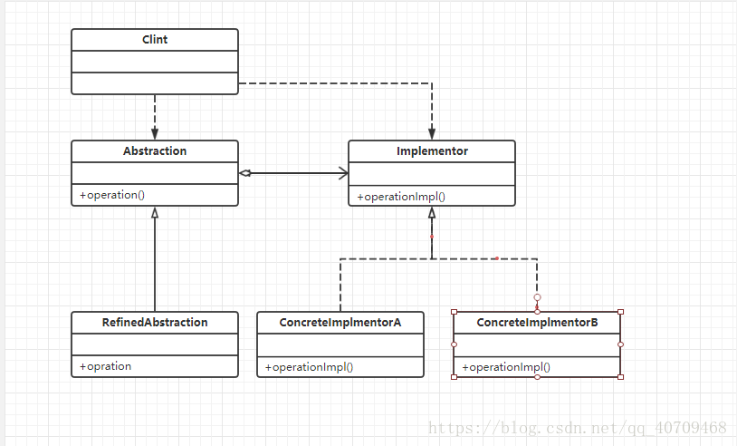

# JAVA设计模式——桥接模式
## 一.主要概念
### 1.定义
    将抽象部分与它的实现部分解耦，使得两者都能独立扩展！
### 2.适配器模式涉及的角色
    Abstraction（抽象类）：桥接模式目的是为了建立抽象类的对象，与另一接口建立关联关系
    
    RefinedAbstraction(扩充抽象类)：抽象类的具体实现（这里体现面向接口编程）
    
    Implmentor(实现类接口)：服务于抽象类，为抽象类提供必要的属性或维度
    
    ConcreteImplmentor(具体实现类):具体实现抽象类的业务。
### 3.桥接模式的UML图

## 二.具体实现
###  Abstraction（抽象类）   
    /**
     * Abstraction（抽象类）:桥接模式目的是为了建立抽象类的对象，与另一接口建立关联关系
     */
    public abstract class Car {
    
        /**
         * 关联关系，使用接口的方式实现关联关系
         * 1.关联关系（弱关联，使用接口的方式降低耦合性），新增颜色只需实现接口
         */
        private Color color;
    
    
        public void setColor(Color color) {
            this.color = color;
        }
    
        public Color getColor() {
            return color;
        }
    
        public abstract void makeCar();
    }
### Implmentor(实现类接口)
    /**
     * Implmentor(实现类接口):服务于抽象类，为抽象类提供必要的属性或维度
     */
    public interface Color {
    
        void addColor(String carType);
    }
### ConcreteImplmentor(具体实现类)
    public class Black implements Color {
    
        @Override
        public void addColor(String carType) {
            System.out.println("黑色"+carType);
        }
    }
### RefinedAbstraction(扩充抽象类)
    /**
     * RefinedAbstraction(扩充抽象类)：抽象类的具体实现（这里体现面向接口编程）
     */
    public class CarImpl extends Car {
    
        @Override
        public void makeCar() {
            getColor().addColor("宝马");
        }
    }

## 三.总结
### 1.结构性模式与建造模式的配合点
    结构模式是为了优化解耦代码结构，而建造模式是在结构模式的基础上再进行对象创建
### 2.使用场景
    一个类（Abstraction（抽象类））有两个独立得维度，或者以上。并且需要各自对立的扩展！
### 3.优缺点
    优点
    采用关联关系，实现类与类直接的解耦，增加了扩展性
    缺点
    两个维度，这个东西很难懂。得需要大量实践。
    
    
    

