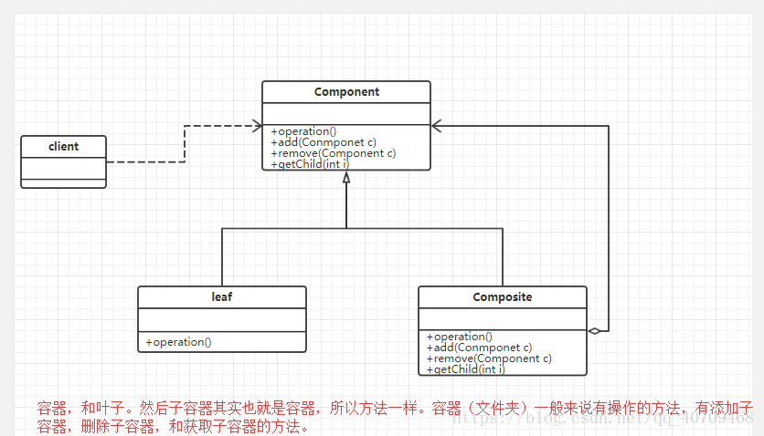

# JAVA设计模式——组合模式

## 一.主要概念
### 1.定义
    组合多个对象形成树形结构以表示有整体-部分关系层次结构，组合模式可以让客户端统一对待单个对象和组合对象
    
    树形结构就是组合模式的体现（eg:文件系统：单个文件就是部分，文件夹就是整体） 树结构
### 2.适配器模式涉及的角色
    抽象组件(Component)角色: 组合对象和叶子对象声明公共接口，声明一个接口用于访问和管理Component的子组件
    
    组合对象(Composite)角色： 通常会存储子组件(组合对象、叶子对象)，定义包含子组件的那些组件的行为，并实现在抽象组件中定义的与子组件有关的操作，
    例如子组件的添加(addChild)和删除(removeChild)等。
    
    叶子对象(Leaf)角色：定义和实现叶子对象的行为，并且它不再包含其他的子节点对象。
    
    客户端(Client)角色：通过Component接口来统一操作组合对象和叶子对象，以创建出整个对象树结构。
### 3.桥接模式的UML图

## 二.具体实现
###  抽象组件(Component)角色
    /**
     * 抽象组件(Component)角色
     * 组合对象和叶子对象声明公共接口，声明一个接口用于访问和管理Component的子组件
     * 定义公司抽象类
     */
    public abstract class Company {
    
        private String name;
    
        public Company(String name) {
            this.name = name;
        }
    
        public Company(){
    
        }
    
        protected abstract void add(Company company);
    
        protected abstract void remove(Company company);
    
        // 展示公司结构
        public abstract void display();
    }
###   组合对象(Composite)角色
    /**
     * 组合对象(Composite)角色(整体)
     * 通常会存储子组件(组合对象、叶子对象)，定义包含子组件的那些组件的行为，并实现在抽象组件中定义的与子组件有关的操作，
     *      例如子组件的添加(addChild)和删除(removeChild)等。
     * 公司节点，存储下级子公司
     */
    public class ProvincialCompany extends Company {
    
        private List<Company> companyList;
    
        public  ProvincialCompany(){
            companyList = new ArrayList<>();
        }
    
        public  ProvincialCompany(String name){
            super(name);
            companyList = new ArrayList<>();
        }
    
        @Override
        protected void add(Company company) {
            companyList.add(company);
        }
    
        @Override
        protected void remove(Company company) {
            companyList.remove(company);
        }
    
        @Override
        public void display() {
            System.out.println(this.getName()+"  下的子公司");
    
            for (Company company : companyList){
                company.display();
            }
        }
    }
### 叶子对象(Leaf)角色
    /**
     * 叶子对象(Leaf)角色（部分）
     * 定义和实现叶子对象的行为，并且它不再包含其他的子节点对象。
     * 地级公司，无子节点
     */
    public class LocalCompany extends Company {
    
        public LocalCompany(String name){
            super(name);
        }
    
    
        @Override
        public void display() {
            System.out.println(this.getName());
        }
    }   
###    客户端(Client)角色   (Test类)
    **
     * test类
     */
    public class Main {
    
        public static void main(String[] args) {
    
            Company root = new ProvincialCompany("总公司");
            root.add(new LocalCompany("上海分公司"));
    
            Company gdCompany =  new ProvincialCompany("广东省分公司");
            gdCompany.add(new LocalCompany("东莞分公司"));
            gdCompany.add(new LocalCompany("佛山分公司"));
    
    
            Company hbCompany =  new ProvincialCompany("湖北省分公司");
            hbCompany.add(new LocalCompany("黄冈分公司"));
            hbCompany.add(new LocalCompany("武汉分公司"));
    
            root.add(gdCompany);
            root.add(hbCompany);
    
            root.display();
    
        }
    }
### 结果
    总公司  下的子公司
    上海分公司
    广东省分公司  下的子公司
    东莞分公司
    佛山分公司
    湖北省分公司  下的子公司
    黄冈分公司
    武汉分公司
## 三.总结
###  1.优缺点
`优点`

    1、清楚地表示分层次的复杂对象且增加删除构件更容易。
    
    2、叶子对象也可以被组合容器对象，容器对象又可以添加多个叶子对象，这样不断递归下去，可以形成表达复杂的树形结构。
    
    3、更容易在组合体内加入对象，客户端不必因为加入了新的对象构件而更改原有代码。
 