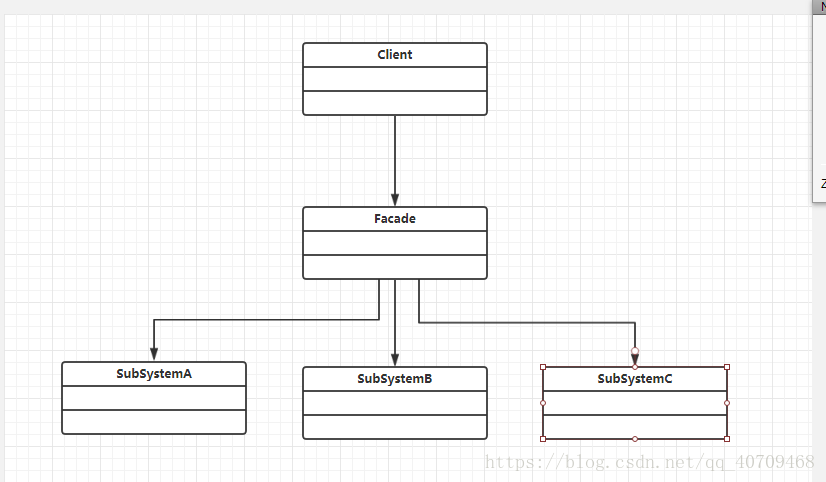

# JAVA设计模式——外观模式

## 一.主要概念
### 1.定义
    外观模式就是提供一个统一接口，用来访问子系统中的一群接口
    
    外观模式定义了一个高层接口，让子系统更容易使用
### 2.外观模式涉及的角色
    外观角色（Facade）： 对客户端接口，用于访问子系统
    子系统角色（subSystem）:具体调用
### 3.外观模式的UML图

## 二.具体实现

### 外观角色（Facade）
    
    /**
     * 外观角色（Facade）： 对客户端接口，用于访问子系统
     */
    public class Facade {
    
        Air air;
    
        Light light;
    
        Tv tv;
    
        public Facade(Air air,Light light, Tv tv){
            this.air = air;
            this.light = light;
            this.tv = tv;
        }
    
        public void open(){
            air.open();
            light.open();
            tv.open();
        }
    
        public void close(){
            air.close();
            light.close();
            tv.close();
        }
    }
### 子系统角色（subSystem）
    /**
     * 子系统角色（subSystem）
     */
    public class Air {
    
        public void open(){
            System.out.println("开空调");
        }
    
        public void close(){
            System.out.println("关空调");
        }
    }
    
    /**
     * 子系统角色（subSystem）
     */
    public class Light {
    
        public void open(){
            System.out.println("开灯");
        }
    
        public void close(){
            System.out.println("关灯");
        }
    }
### test类
    public class Test {
    
        public static void main(String[] args) {
            Facade facade = new Facade(new Air(), new Light(), new Tv());
            System.out.println("回家了:");
            facade.open();
    
            System.out.println("睡觉了:");
            facade.close();
        }
    }
## 三.总结
### 1.优点
    1.客户端对子系统使用简单，实现子系统与客户端解耦
    2.提供访问子系统的统一入口，不影响子系统类
    3.降低了编码依赖性
### 2.jdk
    java.lang.Class
    