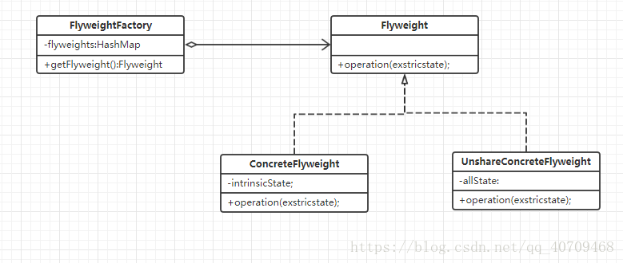

# JAVA设计模式——享元模式

## 一.主要概念
### 1.定义
    运用共享技术有效地支持大量细粒度对象的复用。
    
    在项目中出现很多相同或类似的对象，享元模式会创建一个享元池将这些公共的实例保存在享元池中。可以针对的创建不同的对象，
    然后通过复用的方式进行分配。需要的时候就将对应的对象取出，不需要则放回。
#### 1.1 内部状态与外部状态
    内部状态：共享的部分属性
    外部状态：不能够共享的状态就是外部状态(外部状态由客户端决定)
### 2.外观模式涉及的角色
    1.Flyweight (享元抽象类)： 定义了享元类的公共方法。这些方法可以分享内部状态的数据，也可以调用这些方法修改外部状态。
    2.ConcreteFlyweight(具体享元类)：存储内部状态，存储共享状态的类
    3.UnshareConcreteFlyweight(非共享具体享元类): 非共享具体享元类，指一下不需要共享的享元类
    4.Flyweight(享元工厂类):用来创建和管理Flyweight
    
### 3.享元模式的UML图

## 二.具体实现

### Flyweight (享元抽象类)
    // 抽象享元类 里面包含了共享的状态和非共享状态
    public interface BottleCap {
    
        // 内部状态
        String getColor();
    
        // 外部状态
        String getCode(String different);
    }
    
### ConcreteFlyweight(具体享元类)
    
    /**
     * 具体享元类，他关注我们的整体，对于共享部分自己处理，对于非共享部分，引入非共享部门负责类
     */
    public class OkCap implements BottleCap {
    
        String color;
    
        BottleCap bottleCap;
    
        public OkCap(String color,BottleCap bottleCap){
            this.color = color;
            this.bottleCap = bottleCap;
        }
    
        @Override
        public String getColor() {
            return this.color;
        }
    
        // 享元模式最终想要的对象是一个内部状态+外部状态的完整对象
        @Override
        public String getCode(String different) {
            if (bottleCap != null)
            return bottleCap.getCode(different);
            return "无法打印";
        }
    }
###   UnshareConcreteFlyweight(非共享具体享元类)
    // 非共享部门的子类，他关注于我们的非共享部分
    public class NoCap implements BottleCap {
    
        @Override
        public String getColor() {  // 非共享具体享元类不需要考虑内部状态
            return null;
        }
    
        /**
         * 传入different ，是为了客户端调用，也是为了对code进行特异处理
         * @param different
         * @return
         */
        @Override
        public String getCode(String different) {
            return different + "制作完成";
        }
    } 
 ### Flyweight(享元工厂类)
    /**
     * CapFactory 并不是制造工厂，它是提供了一个享元池工厂，用于维护我们的享元池
     */
    public class CapFactory {
    
        private static Map<String,BottleCap> map = new HashMap<>();
    
    
        public static BottleCap getBottleCap(String color,BottleCap bottleCap){
    
            if (map.get(color) != null){
                return map.get(color);
            }
            BottleCap okCap = new OkCap(color, bottleCap);
            map.put(color,okCap);
            return okCap;
        }
    }   
    
### Test类
    public class Test {
    
        public static void main(String[] args) {
    
            //1. 简单享元模式 （不考虑外部状态）
            BottleCap cap1 = CapFactory.getBottleCap("红色", null);
            BottleCap cap2 = CapFactory.getBottleCap("绿色", null);
            BottleCap cap3 = CapFactory.getBottleCap("蓝色", null);
            System.out.println(cap1.getColor());
            System.out.println(cap1.getCode("二维码"));
    
            BottleCap cap4 = CapFactory.getBottleCap("红色", null);  // 共享对象，与cap1指向同一对象
    
            //2.享元模式  考虑我们的外部状态
            System.out.println("========================================");
            BottleCap cap5 = CapFactory.getBottleCap("www色", new NoCap());
            System.out.println(cap5.getColor());
            System.out.println(cap5.getCode("李四的二维码"));
        }
    }
    
## 三.总结
### 1.享有模式的优缺点及使用场景
#### 优点
    1.节约系统的开销。保证一个常用的对象只有一个！
    2.外部状态不会影响内部状态，可以在不同环境下进行共享哦。
#### 使用场景
    1.一个系统有大量细粒度化的对象，占据大量的内存。
    2.对象大部分属性可以外部化，并且能将外部的属性放入内部属性中来。
    3.使用享元模式需要维护享元池，所以要用那种常用的经常调用的对象可以使用享元模式。
#### jdk源码位置
    java.lang.Integer#valueOf(int)
    java.lang.Boolean#valueOf(boolean)
    java.lang.Byte#valueOf(byte)
    java.lang.Character#valueOf(char)