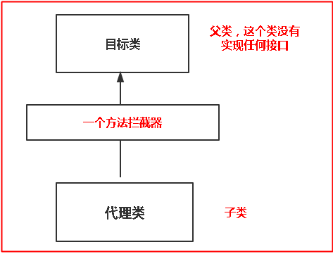

# JAVA设计模式——代理模式

## 一.主要概念
### 1.定义
    代理模式就是给一个对象提供一个代理，并由代理对象控制对原对象的引用
    代理对象启到一个中介作用，它用于连接客户端和目标对象
    
### 2.静态代理与动态代理
#### （1）静态代理
    由程序员创建代理类，在程序运行之前，该类就被编译了
##### 优点
    方便对目标对象进行功能扩展
##### 缺点
    系统新增一个服务，就需要新增一个代理对象！重用性不强
#### （2）动态代理
    动态代理：在程序运行时通过反射机制动态创建
##### 优点
    在编码时，代理逻辑与业务逻辑互相独立，各不影响，没有侵入，没有耦合。
    减少了代码量
        
### 3.外观模式涉及的角色
    1.Subject (抽象角色)：声明真实对象和代理对象的共同接口
    2.Proxy(代理角色)：代理对象与真实对象实现相同接口，所有它能够代理真实对象，代理对象包含真实对象的引用
    3.RealSubject(真实角色): 它代表着真实对象，是我们最终要引用的对象
## 二.代码实现
### 1.静态代理
#### Subject (抽象角色)
    // 抽象角色
    public interface BuyHouse {
        void buyHouse();
    }
#### RealSubject(真实角色)
    // RealSubject(真实角色): 它代表着真实对象，是我们最终要引用的对象
    public class BuyHouseImpl implements BuyHouse {
    
        @Override
        public void buyHouse() {
            System.out.println("我要买房子");
        }
    }
#### Proxy(代理角色)
    // 代理角色：代理对象与真实对象实现相同接口，所有它能够代理真实对象，代理对象包含真实对象的引用
    public class BuyHouseProxy implements BuyHouse {
        // 代理对象包含真实对象的引用
        private BuyHouse buyHouse;
    
        public BuyHouseProxy(BuyHouse buyHouse){
            this.buyHouse = buyHouse;
        }
    
        @Override
        public void buyHouse() {
            buyHouse.buyHouse();
            System.out.println("选择房源");
            System.out.println("谈价钱");
            System.out.println("成交");
        }
    }
### 2.动态代理
#### （1）jdk动态代理
##### 通过实现 InvocationHandler 接口
    // jdk动态代理，通过反射实现
    public class DynamicBuyHouseProxy implements InvocationHandler {
    
        private Object object;
    
        public DynamicBuyHouseProxy(Object object){
            this.object = object;
        }
    
        // 获取代理类
        public Object getProxy(Class tClass){
            Object o = Proxy.newProxyInstance(tClass.getClassLoader(), new Class[]{tClass}, this);
            return o;
        }
    
    
        /**
         * 定义代理过程
         * @param proxy
         * @param method
         * @param args
         * @return 代理类
         * @throws Throwable
         */
        @Override
        public Object invoke(Object proxy, Method method, Object[] args) throws Throwable {
            // 调用buyHouse方法
            Object result = method.invoke(object, args);
            System.out.println("选择房源");
            System.out.println("谈价钱");
            System.out.println("最终敲定购买");
            return result;
        }
    }
##### Test
    public class Test {
    
        public static void main(String[] args) {
            BuyHouseImpl buyHouse = new BuyHouseImpl();
    
            DynamicBuyHouseProxy dynamicBuyHouseProxy = new DynamicBuyHouseProxy(buyHouse);
    
            // 获取代理类
            BuyHouse proxy = (BuyHouse)dynamicBuyHouseProxy.getProxy(BuyHouse.class);
    
            // 当代理对象调用真实对象的方法时，其会自动的跳转到代理对象关联的handler对象的invoke方法来进行调用。
            proxy.buyHouse();
        }
    }
##### 实现原理
    使用Proxy.newProxyInstance方法通过反射生成的最终真正的代理类，它继承自Proxy并实现了我们定义的Subject接口，
    在实现Subject接口方法的内部，通过反射调用了InvocationHandlerImpl的invoke方法。
    
#### （2）.cglib动态代理
##### 基本原理图

##### 目标类
    /**
     * 需要代理的目标类
     */
    public class Dog {
    
        public void eat(String name){
            System.out.println("狗："+ name + " 正在吃东西");
        }
    }
##### 方法拦截器
    /**
     * 方法拦截器
     */
    public class MyMethodInterceptor implements MethodInterceptor {
    
        @Override
        public Object intercept(Object o, Method method, Object[] objects, MethodProxy methodProxy) throws Throwable {
    
            System.out.println("执行前");
            // 调用方法
            Object object = methodProxy.invokeSuper(o, objects);
    
            System.out.println("执行后");
            return object;
        }
    }
##### test
    public class Test {
    
        public static void main(String[] args) {
            //创建Enhancer对象，类似于JDK动态代理的Proxy类
            Enhancer enhancer = new Enhancer();
    
            // 设置目标类
            enhancer.setSuperclass(Dog.class);
    
            // 设置回调函数
            enhancer.setCallback(new MyMethodInterceptor());
    
            // 创建代理类
            Dog proxyDog = (Dog)enhancer.create();
    
            // 调用代理类的eat方法
            proxyDog.eat("小洪");
        }
    }
#### 简单原理
    原理： 利用ASM开源包，对代理对象类的class文件加载进来，通过修改其字节码生成子类来处理。
    
    实现步骤：
    第一步：是经过一系列操作实例化出了Enhance对象，并设置了所需要的参数然后enhancer.create()成功创建出来了代理对象，这个就不多说了...
    
    第二步：调用代理对象的eat（）方法，会进入到方法拦截器的intercept（）方法，在这个方法中会调用proxy.invokeSuper(obj, args);方法
    
    第三步：invokeSuper中，通过FastClass机制调用目标类的方法
## 三.总结

### 1.jdk动态代理与cglib代理区别
#### （1）.何时使用JDK还是CGLiB？  
    1）如果目标对象实现了接口，默认情况下会采用JDK的动态代理实现AOP。
    
    2）如果目标对象实现了接口，可以强制使用CGLIB实现AOP。
    
    3）如果目标对象没有实现了接口，必须采用CGLIB库，Spring会自动在JDK动态代理和CGLIB之间转换。
####  (2)、如何强制使用CGLIB实现AOP？
    1）添加CGLIB库(aspectjrt-xxx.jar、aspectjweaver-xxx.jar、cglib-nodep-xxx.jar)
    
    2）在Spring配置文件中加入<aop:aspectj-autoproxy proxy-target-class="true"/>
    
#### (3)、JDK动态代理和CGLIB字节码生成的区别？
    1）JDK动态代理只能对实现了接口的类生成代理，而不能针对类。
    
    2）CGLIB是针对类实现代理，主要是对指定的类生成一个子类，覆盖其中的方法，
    
####  (4)、CGlib比JDK快？
    1）使用CGLib实现动态代理，CGLib底层采用ASM字节码生成框架，使用字节码技术生成代理类，在jdk6之前比使用Java反射效率要高。唯一需要注意的是，CGLib不能对声明为final的方法进行代理，因为CGLib原理是动态生成被代理类的子类。
    
    2）在jdk6、jdk7、jdk8逐步对JDK动态代理优化之后，在调用次数较少的情况下，JDK代理效率高于CGLIB代理效率，只有当进行大量调用的时候，jdk6和jdk7比CGLIB代理效率低一点，但是到jdk8的时候，jdk代理效率高于CGLIB代理，总之，每一次jdk版本升级，jdk代理效率都得到提升，而CGLIB代理消息确有点跟不上步伐。
    
####  (5)、Spring如何选择用JDK还是CGLiB？
    1）当Bean实现接口时，Spring就会用JDK的动态代理。
    
    2）当Bean没有实现接口时，Spring使用CGlib是实现。
    
    3）可以强制使用CGlib（在spring配置中加入<aop:aspectj-autoproxy proxy-target-class="true"/>）。
    

### 1.jdk源码位置
    java.lang.reflect.Proxy